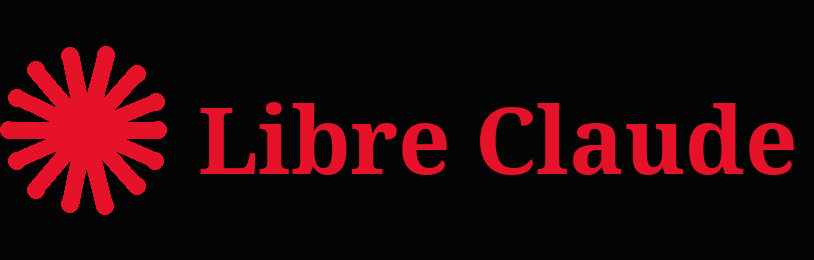
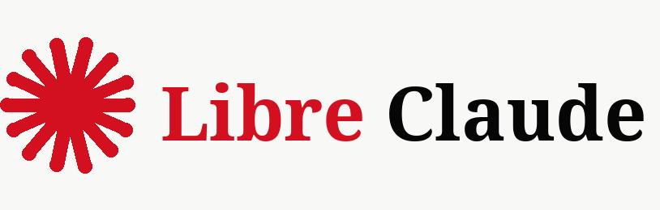

<p align="center">
  
</p>

<p align="center">
  <strong>Assistant IA libre, auto-hébergeable, en PHP + SQLite, avec une interface type Claude Code.</strong>
</p>

<p align="center">
  
  
  
  
  
  
</p>

---

## Aperçu

**Libre Claude** est une interface conversationnelle web inspirée des assistants IA modernes, conçue pour tourner sur un hébergement mutualisé type Hostinger.

Le projet utilise PHP pur, SQLite, cURL et des modèles affichés dans l'interface comme des modèles Claude. Il inclut une installation initiale, une authentification, un historique de conversations, une rotation des clés API et une interface responsive rouge/noir.

## Fonctionnalités

- Interface chat responsive avec sidebar et historique.
- Page d'installation initiale de l'instance.
- Premier compte administrateur créé au setup.
- Authentification avec mots de passe hashes.
- Sessions stockées en base SQLite.
- Conversations et messages persistants par utilisateur.
- Support de plusieurs modèles Claude organisés par catégorie.
- Rotation automatique des clés API partagées.
- Clé API personnelle configurable par utilisateur.
- Pool de clés Claude serveur administrable depuis l'interface.
- Clés API internes Libre Claude (`lc_sk_...`) pour intégrer vos propres scripts.
- Dictée vocale avec Voxtral (`voxtral-mini-latest`) depuis le champ de message.
- Interface multilingue : français, anglais, espagnol, allemand et italien.
- Prévisualisation directe des blocs HTML/CSS/JS/SVG dans un panneau intégré.
- Workspace utilisateur pour sauvegarder les blocs de code générés.
- Connexion GitHub par dépôt, branche et token optionnel pour afficher l'arborescence du repo.
- Connexion GitHub OAuth : l'utilisateur autorise l'app, puis choisit un dépôt accessible.
- Création de dépôts GitHub depuis le workspace.
- Ajout ou modification de fichiers GitHub avec commit direct depuis l'interface.
- Envoi de plusieurs fichiers GitHub en un seul commit depuis un tableau JSON.
- Rendu Markdown des réponses.
- Assets de marque inclus : logo clair, logo sombre et icône.
- Compatible hébergement mutualisé : pas de `exec`, pas de `shell_exec`, pas de `putenv`.

## Captures / Branding

| Logo sombre | Logo clair | Icône |
| --- | --- | --- |
|  |  |  |

## Prérequis

- PHP 8.3 ou plus récent.
- Extension PHP `pdo_sqlite`.
- Extension PHP `curl`.
- Un serveur Apache ou compatible PHP.
- Une ou plusieurs clés API Claude.

## Installation

1. Envoyez tous les fichiers dans le dossier web de votre hébergement, par exemple `public_html/`.
2. Vérifiez que PHP peut créer les dossiers `data/` et `sandbox/`.
3. Ouvrez votre domaine dans le navigateur.
4. Si aucun compte n'existe, Libre Claude redirige automatiquement vers `setup.php`.
5. Créez le compte administrateur et ajoutez les clés Claude partagées si besoin.
6. Connectez-vous et commencez une conversation.

## Installation Docker

Libre Claude peut aussi tourner dans une image Docker Apache + PHP.

### Installation one-line

Installation moderne depuis GitHub avec `curl` :

```bash
curl -fsSL https://raw.githubusercontent.com/AnARCHIS12/Libre-claude/main/install.sh | sh
```

Version avec URL GitHub classique :

```bash
curl -fsSL https://github.com/AnARCHIS12/Libre-claude/raw/main/install.sh | sh
```

Changer le port :

```bash
curl -fsSL https://raw.githubusercontent.com/AnARCHIS12/Libre-claude/main/install.sh | LIBRE_CLAUDE_PORT=8080 sh
```

Installer dans un dossier précis :

```bash
curl -fsSL https://raw.githubusercontent.com/AnARCHIS12/Libre-claude/main/install.sh | LIBRE_CLAUDE_DIR=/opt/libre-claude sh
```

Avec OAuth GitHub dès l'installation :

```bash
curl -fsSL https://raw.githubusercontent.com/AnARCHIS12/Libre-claude/main/install.sh | \
  GITHUB_OAUTH_CLIENT_ID=votre_client_id \
  GITHUB_OAUTH_CLIENT_SECRET=votre_client_secret \
  sh
```

Le script crée :

```text
~/libre-claude/
├── docker-compose.yml
├── .env
├── data/
└── sandbox/
```

Puis il lance directement l'image :

```text
liberchat/libre-claude:latest
```

### Lancement rapide avec Docker Compose

1. Copiez le fichier d'environnement :

```bash
cp .env.example .env
```

2. Renseignez OAuth GitHub dans `.env` si vous voulez activer `Se connecter avec GitHub` :

```env
GITHUB_OAUTH_CLIENT_ID=votre_client_id
GITHUB_OAUTH_CLIENT_SECRET=votre_client_secret
```

3. Construisez et lancez :

```bash
docker compose up -d --build
```

4. Ouvrez :

```text
http://127.0.0.1:8173
```

Les dossiers `data/` et `sandbox/` sont montés en volume local, donc la base SQLite reste persistante entre les redémarrages.

### Build image Docker

```bash
docker build -t libre-claude:local .
```

Lancer l'image :

```bash
docker run -d \
  --name libre-claude \
  -p 8173:80 \
  -v "$PWD/data:/var/www/html/data" \
  -v "$PWD/sandbox:/var/www/html/sandbox" \
  -e GITHUB_OAUTH_CLIENT_ID="votre_client_id" \
  -e GITHUB_OAUTH_CLIENT_SECRET="votre_client_secret" \
  libre-claude:local
```

### Push vers Docker Hub

Remplacez `votre-compte` par votre compte Docker Hub :

```bash
docker login
docker build -t votre-compte/libre-claude:latest .
docker push votre-compte/libre-claude:latest
```

Versionner une release :

```bash
docker tag votre-compte/libre-claude:latest votre-compte/libre-claude:1.0.0
docker push votre-compte/libre-claude:1.0.0
```

### Déploiement production avec l'image publiée

Le fichier `docker-compose.prod.yml` utilise directement l'image Docker Hub :

```yaml
image: liberchat/libre-claude:latest
```

Lancer en production :

```bash
cp .env.example .env
docker compose -f docker-compose.prod.yml pull
docker compose -f docker-compose.prod.yml up -d
```

Mettre à jour :

```bash
docker compose -f docker-compose.prod.yml pull
docker compose -f docker-compose.prod.yml up -d
```

Les données SQLite et le sandbox sont persistés dans des volumes Docker nommés :

```text
libre_claude_data
libre_claude_sandbox
```

### Push vers GitHub Container Registry

Connectez-vous à GHCR avec un token GitHub ayant le droit `write:packages` :

```bash
echo "VOTRE_TOKEN_GITHUB" | docker login ghcr.io -u VOTRE_USER_GITHUB --password-stdin
docker build -t ghcr.io/VOTRE_USER_GITHUB/libre-claude:latest .
docker push ghcr.io/VOTRE_USER_GITHUB/libre-claude:latest
```

Lancer l'image GHCR :

```bash
docker run -d \
  --name libre-claude \
  -p 8173:80 \
  -v "$PWD/data:/var/www/html/data" \
  -v "$PWD/sandbox:/var/www/html/sandbox" \
  ghcr.io/VOTRE_USER_GITHUB/libre-claude:latest
```

## Configuration

Les constantes principales se trouvent dans `config.php`.

```php
define('DEFAULT_MISTRAL_API_KEYS', [
    'votre_clé_1',
    'votre_clé_2',
    'votre_clé_3',
]);
```

Les clés ajoutées dans `setup.php` sont stockées en base dans `app_settings` et sont utilisées en priorité. Si aucune clé n'est configurée dans l'instance, Libre Claude utilise `DEFAULT_MISTRAL_API_KEYS`.

### GitHub OAuth

Pour éviter de coller un token GitHub manuellement, créez une OAuth App GitHub.

### Créer l'OAuth App GitHub

1. Ouvrez GitHub.
2. Allez dans `Settings`.
3. Ouvrez `Developer settings`.
4. Ouvrez `OAuth Apps`.
5. Cliquez `New OAuth App`.
6. Renseignez :

```text
Application name: Libre Claude
Homepage URL: http://127.0.0.1:8173
Authorization callback URL: http://127.0.0.1:8173/github_oauth.php
```

En production, remplacez `http://127.0.0.1:8173` par votre domaine :

```text
Homepage URL: https://votre-domaine.com
Authorization callback URL: https://votre-domaine.com/github_oauth.php
```

7. Cliquez `Register application`.
8. Copiez le `Client ID`.
9. Cliquez `Generate a new client secret`.
10. Copiez le `Client Secret`.

### Activer OAuth sans Docker

Renseignez ensuite `config.php` :

```php
define('GITHUB_OAUTH_CLIENT_ID', 'votre_client_id');
define('GITHUB_OAUTH_CLIENT_SECRET', 'votre_client_secret');
```

### Activer OAuth avec Docker

Renseignez `.env` :

```env
GITHUB_OAUTH_CLIENT_ID=votre_client_id
GITHUB_OAUTH_CLIENT_SECRET=votre_client_secret
```

Puis relancez :

```bash
docker compose up -d --build
```

Après ça, le bouton `Se connecter avec GitHub` apparaît dans le Workspace. L'utilisateur autorise Libre Claude, puis choisit un dépôt accessible.

## Structure

```text
votre-domaine.com/
├── index.php                         Interface principale
├── setup.php                         Installation initiale
├── login.php                         Connexion
├── register.php                      Inscription
├── logout.php                        Déconnexion
├── settings.php                      Paramètres utilisateur
├── admin_keys.php                    Pool de clés Claude serveur
├── api_tokens.php                    Clés API internes Libre Claude
├── workspace.php                     Workspace code et connexion GitHub
├── workspace_api.php                 API de sauvegarde des blocs de code
├── chat.php                          API de chat
├── transcribe.php                    API dictée vocale Voxtral
├── conversations.php                 API conversations
├── auth.php                          Authentification
├── i18n.php                          Traductions multilingues
├── config.php                        Configuration globale
├── database.php                      Accès SQLite et schéma
├── claude.php                        Client API Claude
├── github_oauth.php                  Callback OAuth GitHub
├── install.sh                        Installateur one-line curl
├── Dockerfile                        Image Docker Apache + PHP
├── docker-entrypoint.sh              Préparation permissions Docker
├── docker-compose.yml                Lancement Docker local
├── docker-compose.prod.yml           Lancement production avec image publiée
├── .env.example                      Variables Docker exemple
├── libre-claude-red-black-dark.png   Logo sombre
├── libre-claude-red-black.png        Logo clair
├── libre-claude-icon.png             Icône / favicon
└── data/
    ├── libre_claude.sqlite           Base créée automatiquement
    └── libre_claude.log              Logs applicatifs
```

## Base de données

La base SQLite est créée automatiquement au premier accès :

```text
data/libre_claude.sqlite
```

Tables principales :

- `users`
- `sessions`
- `conversations`
- `messages`
- `app_settings`
- `api_tokens`

## Clés Claude et clés internes

Libre Claude sépare deux types de secrets :

- **Clés Claude serveur** : vraies clés Claude, visibles uniquement par l'admin dans `admin_keys.php`.
- **Clés Libre Claude** : tokens internes générés dans `api_tokens.php`, au format `lc_sk_...`.

Les tokens internes permettent d'appeler votre interface comme une API sans partager la clé Claude réelle :

```bash
curl https://votre-domaine.com/chat.php \
  -H 'Authorization: Bearer lc_sk_votre_clé' \
  -H 'Content-Type: application/json' \
  -d '{"message":"Bonjour Libre Claude","model":"claude-opus-4.5"}'
```

La réponse contient un `conversation_id`. Pour continuer le même fil :

```bash
curl https://votre-domaine.com/chat.php \
  -H 'Authorization: Bearer lc_sk_votre_clé' \
  -H 'Content-Type: application/json' \
  -d '{"conversation_id":1,"message":"Continue","model":"claude-opus-4.5"}'
```

Le serveur vérifie la clé `lc_sk_...`, retrouve l'utilisateur associé, crée ou charge sa conversation, puis appelle l'API avec le pool de clés serveur ou la clé personnelle de l'utilisateur.

## Compatibilité Hostinger

- cURL uniquement pour les appels HTTP.
- SQLite local, sans service MySQL obligatoire.
- Chemins basés sur `dirname(__FILE__)`.
- Dossiers créés automatiquement en permissions `0755`.
- Aucun appel système interdit en mutualisé.
- Polices système, sans import Google Fonts.

## Sécurité

- Hash des mots de passe via `password_hash`.
- Protection contre les tentatives de connexion répétée.
- Sessions persistantes en base.
- Clé API personnelle stockée par utilisateur.
- Logs applicatifs séparés dans `data/libre_claude.log`.

## Migration depuis l'ancien nom

Si vous aviez déjà une base créée sous l'ancien nom, renommez-la avant le lancement :

```bash
mv data/voanh.sqlite data/libre_claude.sqlite
mv data/voanh.log data/libre_claude.log
```

## Licence

Projet privé ou interne par défaut. Ajoutez un fichier `LICENSE` si vous souhaitez publier Libre Claude sous une licence open source.
